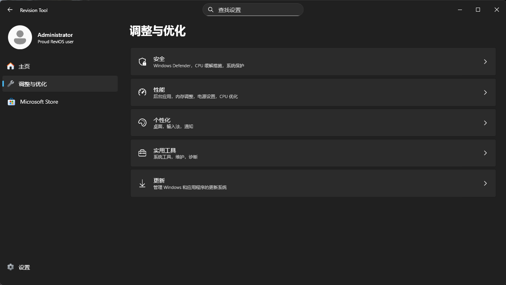
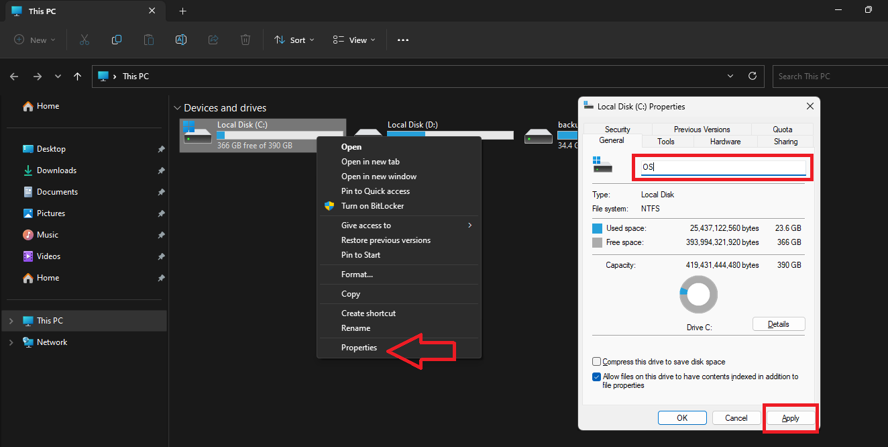
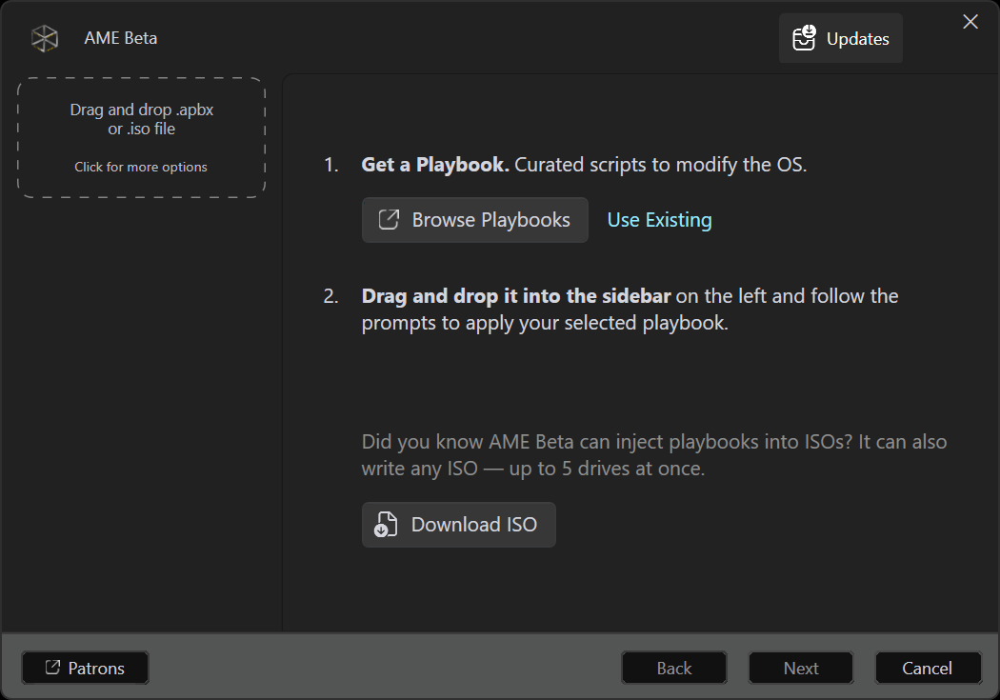
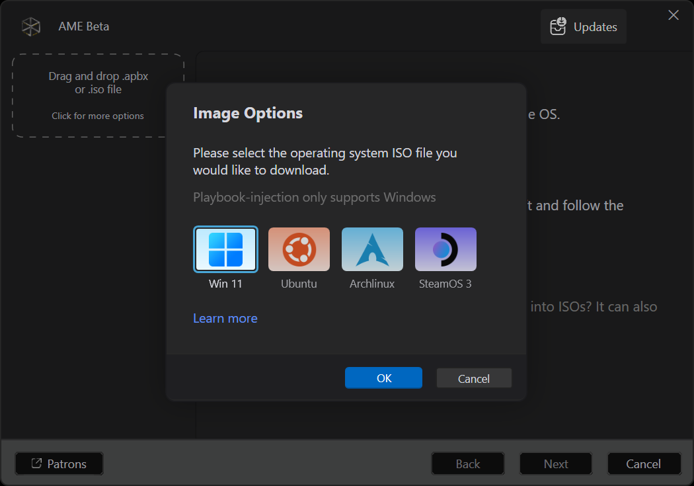
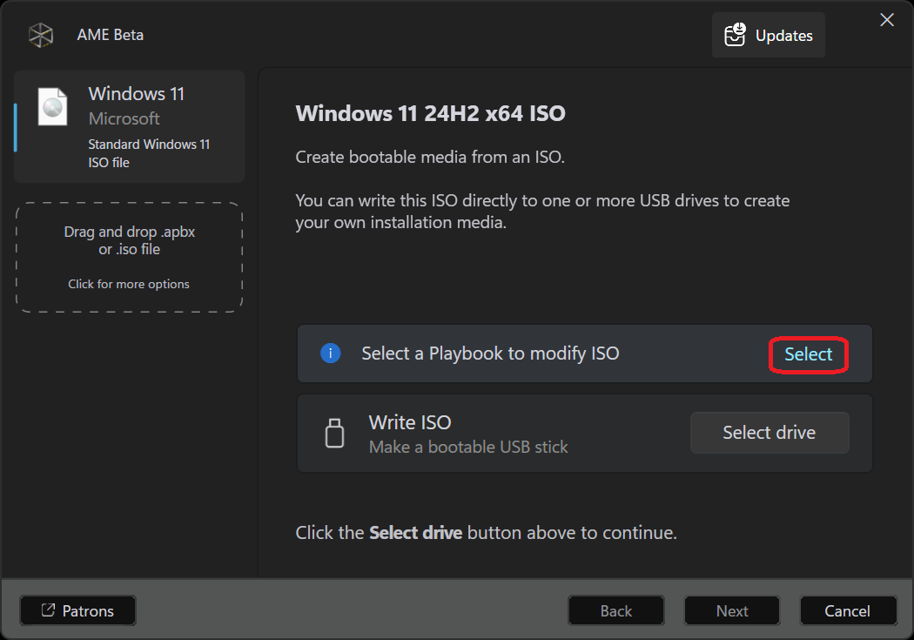
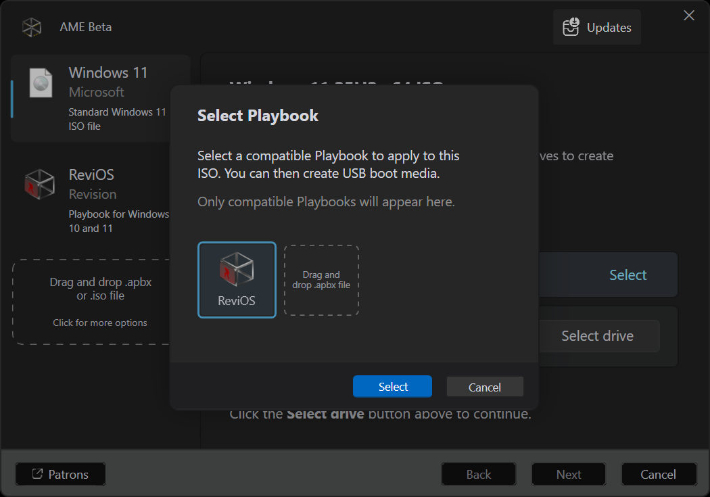

import Callout from '@/components/Callout.astro'

## 前言

ReviOS 是基于 Windows 的定制优化方案，通过移除不必要的组件、调整系统服务和优化默认配置来提升性能、降低延迟和减少资源占用。偏向综合优化，保留更多功能，适合日常使用+游戏。

现在最新版采用 **AME + Playbook** 模式分发，不再提供完整的 ISO 镜像，而是通过 AME Wizard 加载 Playbook（.apbx 文件）来对现有系统或安装镜像进行修改。

<Callout variant="warning">
  **操作前请务必备份数据！修改系统配置有一定风险。**
</Callout>

## 前置准备

下载所需文件：

1. **AME Wizard** — 从 [amewizard.com](https://amewizard.com) 下载最新版
2. **ReviOS Playbook** — 从 [revi.cc](https://revi.cc) 下载 `.apbx` 文件
3. **Windows 11 官方 ISO**（如使用 ISO 注入方案）— 从微软官网下载

## 部署后的工具箱

ReviOS 部署完成后，开始菜单或桌面上会出现 **ReviOS 工具箱**，用于控制优化功能的开启与关闭。

通过工具箱可以：

- 启用/禁用 Windows Defender
- 开关系统还原点
- 控制 Windows Update（开启/暂停/关闭）
- 调整隐私设置
- 安装常用运行库（VC++、DirectX、.NET）
- 还原被修改的系统组件



<Callout variant="tip">
  如果你只是想临时关闭 Defender 或调整更新策略，不需要重新部署，直接在工具箱里开关即可。
</Callout>

## 方案一：AME Playbook 在线部署（无需重装）

直接在当前系统上运行 AME Wizard + Playbook，不需要重装。

### 操作步骤

**1. 准备工作**

- 确保系统已激活
- 关闭 Defender 实时保护和第三方杀毒软件
- 备份重要数据

**2. 运行 AME Wizard**

```
1. 下载 AME Wizard 和 Playbook（.apbx）到本地目录
2. 右键 AME Wizard.exe → 以管理员身份运行
3. 点击 Browse，选择下载好的 .apbx Playbook 文件
4. 点击 Play 开始部署
```

**3. 部署过程**

AME Wizard 会自动执行：

- 移除遥测和间谍组件
- 禁用不必要的后台服务
- 调整电源计划
- 优化网络参数
- 移除预装应用（Edge、OneDrive 等）
- 应用注册表优化

整个过程约 5-10 分钟，期间会自动重启 1-2 次。

<Callout variant="warning">
  部署期间不要强制关机！AME Wizard 修改系统组件时中断可能导致系统损坏。
</Callout>

**4. 重启生效**

重启后优化即生效，你会明显感觉到：

- 开机速度提升
- 内存占用降低
- 后台进程减少
- 游戏帧率更稳定

## 方案二：ISO 注入部署（适合全新安装）

把 Playbook 注入到 Windows ISO 中，安装时直接得到优化后的系统。适合重装或新装机的用户。

<Callout variant="warning">
  ISO 注入是一个实验性的复杂过程，存在一些已知问题。建议优先使用方案一的在线部署。
</Callout>

### 已知问题

- 某些情况下会出现 "Could not find log directory" 错误 → 尝试以管理员身份运行 AME Beta
- VMware 剪贴板共享在重启后不工作
- 经典右键菜单调整不生效（使用 Revision Tool 工具箱修改）
- Firefox 安装耗时较长（AME Beta 问题）→ 用任务管理器结束 chocolatey 进程，或临时断开网络

### 前置准备

- **U 盘** — 至少 8GB，数据会清空请提前备份
- **备份数据** — 强烈建议备份所有重要文件
- **重命名当前 C 盘** — 建议把当前 C 盘改名为 `OS` 之类的名字，方便安装时识别



- **下载最新文件** — 始终下载最新版 AME Beta 和 ReviOS Playbook

### 下载必要文件

- **AME Beta** — 从 [GitHub Releases](https://github.com/Ameliorated-LLC/trusted-uninstaller-cli/releases/latest) 下载
- **ReviOS Playbook** — 从 [revi.cc](https://revi.cc) 下载 `.apbx` 文件

### 下载 Windows ISO

AME Beta 内置了 ISO 下载功能：

1. 打开 AME Beta
2. 点击 **Download ISO** 按钮
3. 选择 **Win 11**，点击 OK
4. 等待下载完成（取决于网速）




### 加载 ReviOS Playbook

ISO 下载完成后，会显示 "Select a Playbook to modify ISO" 提示：

1. 点击 **Select** 按钮
2. 拖放或浏览选择下载好的 `.apbx` 文件
3. 点击 **Select** 确认




### 配置安装选项

1. 多次点击 **Next**，直到进入 **Configure Options** 页面
2. 点击 **Select options**，选择需要的组件和设置
3. ⭐ **重要**：务必勾选 **Include additional drivers**，确保网络正常
4. 点击 **Next** 继续

### 设置 ISO 凭据

1. 弹出 "ISO Credentials" 对话框
2. 建议使用 `User` 作为用户名
3. 可选设置密码，不设则无密码
4. 点击 **OK**

### 写入 U 盘（可选）

AME Beta 后续版本将支持直接写入 U 盘。目前可以用 Rufus 将生成的 ISO 写入 U 盘启动安装。

### 后期修复

安装完成后如遇到问题：

- **蓝牙无法使用** — 以管理员身份运行终端，执行：
  ```bash
  reg delete "HKLM\SYSTEM\Setup" /v "OOBEInProgressDriverUpdatesPostponed" /f
  ```
- **Ctrl+Alt+Delete 失效** — 以管理员身份运行终端，执行：
  ```bash
  reg delete "HKLM\SOFTWARE\Microsoft\Windows\CurrentVersion\OOBE\SystemProtected" /v "DisableCAD" /f
  ```

## 注意事项

### 兼容性

- **反作弊** — 部分游戏反作弊（Vanguard、EAC）可能检测到系统修改，AME Wizard 提供恢复功能
- **企业软件** — 某些 VPN/DRM 软件可能依赖完整 Windows 组件
- **外设驱动** — 某些打印机、采集卡驱动需要额外组件

<Callout variant="tip">
  部署过程中 AME Wizard 和 Playbook 可能会访问 GitHub 获取更新或下载必要组件。建议提前配置好代理环境，避免因网络问题导致部署中断。
</Callout>

### 恢复方法

AME Wizard 支持一键回滚：

```
打开 AME Wizard → 选择同一个 Playbook
在 More Options 中选择 Uninstall → 等待恢复完成
```

### 更新策略

ReviOS 保留 Windows Update，可以正常接收安全更新。

## 总结

| 部署方式 | 适用场景 | 优点 | 缺点 |
|---------|---------|------|------|
| AME Playbook 在线部署 | 现有系统优化 | 不用重装，保留数据 | 优化深度不如重装 |
| ISO 注入 | 全新安装 | 一步到位，最干净 | 需要制作启动盘 |

**个人建议：** 现有系统直接在线跑 Playbook，重装就用 ISO 注入模式。两者基于同一个 Playbook，效果一样。
